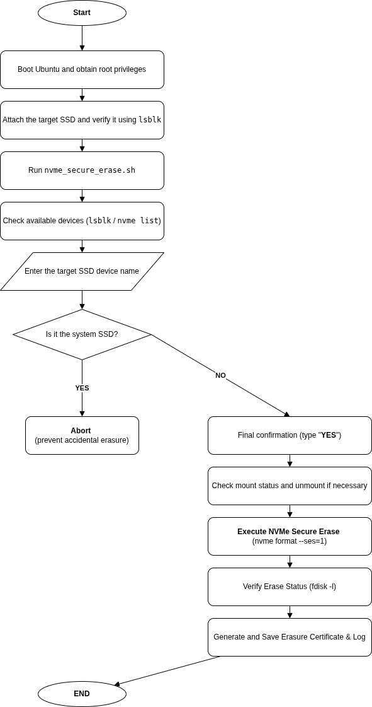

# nvme-secure-erase-tool

Enterprise-grade NVMe Secure Erase automation tool with multi-layer safety controls and audit trail generation (Linux).

> ⚠️ Designed for enterprise infrastructure environments requiring verifiable secure data destruction.

---

## Overview

This tool automates NVMe Secure Erase operations on Linux systems.

Unlike simple file deletion or filesystem formatting,  
this tool executes controller-level Secure Erase using:

The design prioritizes operational risk mitigation and irreversible data sanitization.

```
nvme format --ses=1
```

It is designed for **enterprise-grade secure data destruction**,  
including operational safety checks and audit trail generation.

---

## Why I Built This

During infrastructure operations, I encountered situations where:

- SSDs were being reused without guaranteed data wipe
- Devices containing OS images had to be securely destroyed
- Internal audit required proof of deletion
- Risk of accidental system disk erasure had to be eliminated

This tool was built to solve those real-world operational risks.

It focuses on:

- Preventing catastrophic mistakes
- Ensuring irreversible data destruction
- Producing verifiable deletion records

---

## Architecture & Flow

Below is the execution flow of the secure erase process:



The flow ensures:

- System disk detection
- Explicit human confirmation
- Mount state validation
- Secure erase execution
- Post-erase verification
- Log and certificate generation

---

## Core Safety Design

This script includes multiple layers of protection:

- Automatically detects the currently running system disk
- Immediately aborts if the system disk is selected
- Requires explicit `YES` confirmation
- Checks and unmounts target devices if necessary
- Generates execution logs
- Produces deletion certificate data (model / serial / timestamp)

These protections significantly reduce operational risk.

---

## Features

- Mounted device detection
- System disk protection
- NVMe device validation
- Human confirmation gate
- Controller-level secure erase
- Erasure verification
- Log generation
- Audit-ready output

---

## What Secure Erase Actually Does

The command:

```
nvme format --ses=1
```

Performs:

- Logical invalidation of all user LBA regions
- Destruction of encryption keys (if enabled)
- Controller-level reset of user data areas

This is **not** a filesystem format.

It is a hardware-level secure erase.

---

## What Gets Completely Erased

- All user files
- All partitions
- All filesystems (ext4, NTFS, etc.)
- Installed OS (Linux / Windows)
- Previously deleted residual data
- Disk encryption keys

Data recovery after this process is not possible using software tools.

---

## What Cannot Be Erased (By Design)

The following SSD metadata remains (as per hardware design):

- Power cycle count
- Power-on hours
- Total write amount
- Model name
- Serial number
- Firmware version

These are controller-level statistics and not user data.

---

## Audit & Compliance Support

The script generates:

- Execution logs
- Device identification records
- Timestamped erase confirmation

This allows verification of:

- When the erase was performed
- Which device was erased
- Which method was used

Suitable for internal audit and asset disposal documentation.

---

## Script File

The main executable script in this repository is:

- `nvme_secure_erase.sh`

This script implements all safety checks and secure erase logic described above.

---

## Requirements

- Linux
- nvme-cli installed
- Root privileges

---

## Example Execution

```bash
sudo ./nvme_secure_erase.sh
```

When prompted, enter the target device (example: `/dev/nvme1n1`).

---

## Disclaimer

Use at your own risk.

Always verify the target device before executing Secure Erase.

This tool includes safety checks, but responsibility remains with the operator.

---

## Author

Takahiro Okawa  
Infrastructure Engineer  
Linux / Automation / Secure Operations
